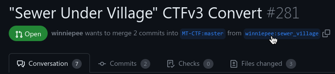

# The Map Tester's Handbook

## Table of Contents
- [Prerequisites](https://github.com/CTF-Handbooks/map-tester-handbook/blob/main/tester-handbook.md#prequisites)
- [Structure of the CTF Maps Repository](https://github.com/CTF-Handbooks/map-tester-handbook/blob/main/tester-handbook.md#structure-of-the-ctf-maps-repository)
	1. [Where do I find the CTF maps?](https://github.com/CTF-Handbooks/map-tester-handbook/blob/main/tester-handbook.md#1-where-do-i-find-the-ctf-maps)
	2. [What do the folders and files mean?](https://github.com/CTF-Handbooks/map-tester-handbook/blob/main/tester-handbook.md#2-what-do-the-folders-and-files-mean)
- [What is GitHub and Git?](https://github.com/CTF-Handbooks/map-tester-handbook/blob/main/tester-handbook.md#what-is-github-and-git)
- [Git Terminology](https://github.com/CTF-Handbooks/map-tester-handbook/blob/main/tester-handbook.md#git-terminology)
- [How to know which maps to review?](https://github.com/CTF-Handbooks/map-tester-handbook/blob/main/tester-handbook.md#how-to-know-which-maps-to-review)
	- [Where to find Map PRs?](https://github.com/CTF-Handbooks/map-tester-handbook/blob/main/tester-handbook.md#where-to-find-map-prs)
	- [Labels on Pull Requests](https://github.com/CTF-Handbooks/map-tester-handbook/blob/main/tester-handbook.md#labels-on-pull-requests)
- [Fetching PR files for testing](https://github.com/CTF-Handbooks/map-tester-handbook/blob/main/tester-handbook.md#fetching-pr-files-for-testing)
- [Testing the Map](https://github.com/CTF-Handbooks/map-tester-handbook/blob/main/tester-handbook.md#testing-the-map)
	1. [Map config](https://github.com/CTF-Handbooks/map-tester-handbook/blob/main/tester-handbook.md#1-map-config)
	2. [Making the world](https://github.com/CTF-Handbooks/map-tester-handbook/blob/main/tester-handbook.md#2-making-the-world)
	3. [Playing the game](https://github.com/CTF-Handbooks/map-tester-handbook/blob/main/tester-handbook.md#3-playing-the-game)
	4. [Selecting the Map](https://github.com/CTF-Handbooks/map-tester-handbook/blob/main/tester-handbook.md#4-selecting-the-map)
	5. [Map Requirements](https://github.com/CTF-Handbooks/map-tester-handbook/blob/main/tester-handbook.md#5-map-requirements)
		- [Basics](https://github.com/CTF-Handbooks/map-tester-handbook/blob/main/tester-handbook.md#basics)
		- [Mechanics](https://github.com/CTF-Handbooks/map-tester-handbook/blob/main/tester-handbook.md#mechanics)
	6. [*Your opinion is the key!*](https://github.com/CTF-Handbooks/map-tester-handbook/blob/main/tester-handbook.md#6-your-opinion-is-the-key)
	7. [Posting your review](https://github.com/CTF-Handbooks/map-tester-handbook/blob/main/tester-handbook.md#7-posting-your-review)

---
## Prerequisites
1. The `Capture the Flag` game. To get it,
	- Go to the `Content` Tab in your Minetest client.
	- Click `Browse Online Content` 
	- Search for `capturetheflag` (make sure that the `Games` category is selected)
	- Click on the `+` icon to install it.
2. `WorldEdit` mod.
	- Download it as you did for the CTF game, but you should have `Mods` as the category set.

---
## Structure of the CTF Maps Repository

### 1. Where do I find the CTF maps?
All the [maps on CTF](https://github.com/mt-CTF/maps) are in a repository on [GitHub](https://en.wikipedia.org/wiki/GitHub), the website via which you may be reading this.

### 2. What do the folders and files mean?
The repository contains folders dedicated to each map. For example, the folder containing the required files for the “Intervention in the Ice Age” Map is in the folder `iceage`. The files within a map folder in the repository should be as shown below:
```
<map folder>
  ├── barriers.data
  ├── map.conf
  ├── map.mts
  └── screenshot.png
```
1. `barriers.data` : The file containing barrier data for the map.
2. `map.conf`: The file contains metadata about various values and fields essential to the map.
3. `map.mts`: A schematic file (`.mts`) is used to import the map into the game world.
4. `screenshot.png`: A screenshot of the map. It should make the important parts of the map visible and needs to have an aspect ratio of 3:2 (600×400px is suggested).

## What is GitHub and Git?
GitHub is a platform that hosts Git repositories and provides developers with several tools to assist their projects. Git is a free and open-source version control system designed to handle everything from small to very large projects. Basically, GitHub is a site for managing code and various other projects using Git. For now, this handbook will only cover the basic ways of obtaining the files you require for testing maps without the need of any command line interface. The handbook for that is a work in progress.

---
## Git Terminology
Below is a list of a few terms you should be aware of while testing maps and using GitHub. Don't be intimidated by these; keep them in mind for future reference.
- A **repository**, is the remote storage in which code is stored.
> In this case, the map's repository only contains the map folders and their respective files.
- A **fork** is a new repository that shares code and settings from the original repository. It can be modified and then be made into a **pull request** if needed.
> Here, map makers will be _forking the maps repository, making their additions, like adding maps or enhancements to existing maps, and then making a Pull Request_ (more on that below).
- A **branch** refers to a separate line of development that initially has the same code base as the repository in which it was made. This new branch can have its own set of files and commits.
- A **commit** means saving changes to a project's files to the repository.
- A **pull** from a repository means getting the source code from the remote repository to one's local machine
- A **push** means pushing the locally built source code to a remote repository on a repository management platform such as GitHub.
- A **pull request** (PR) refers to when you make changes in one of your branches and try to integrate those changes with the main repository.

---
## How do you know which maps to review?
#### *Where to find Map PRs?*
- Go to the [maps repository](https://github.com/mt-CTF/maps) on your web browser.
- Click the "Pull Requests" section:

- You will come to notice PRs with some labels. If you click the PR, it will take you to it.
- There will be a series of tabs that will help you navigate through the things related to the specific PR. (An example image is shown below)

- You discuss about the PR and post your reviews in the ***Conversation*** section. The ***Commits*** tab lists the commit history (basically the various series of changes made in it). Similarly, the **Files changed** tab mentions the files that have been added and changed.

#### *Labels on Pull Requests*
The Map PRs have labels that indicate their current development stage and give information about them. You should look for the ***"New Map"*** and ***"Review Required :mag:"*** as they are the ones that need to be reviewed. There are also others, such as, ***"PR not created properly"*** ***"WIP :building_construction:"*** (= Work In Progress), ***"Enhancement"***, ***"Action/change needed :grey_exclamation:"*** and so on. An good example of a PR that you can test is:


---
## Fetching PR files for testing
- Go to the `Pull Requests` tab and select the PR you would like to review.
- Click on the blue text indicating the `<pr-author>:<branch-of-their-fork>` as shown below.

- After doing so, use the `Download ZIP` option like this:

- Extract the ZIP folder and select the particular map folder that has been added by the author of the PR within the extracted folders. In the example PR mentioned, the folder is `sewer_village`
- After successfully identifying the new map folder, copy and paste it to `<YOUR MINETEST FOLDER>/games/capturetheflag/mods/ctf/ctf_map/maps/` on your computer.

> Sometimes you may not know where your Minetest folder is on some operating systems. Going to the `About` section in Minetest and pressing the "Open User Data Directory" button should lead you there.  

- You have now retrieved the required map folder!
> Make sure that the map has all the required files, namely, `map.mts`, `map.conf`, and `screenshot.png`. If not, then drop a message regarding it in the PR if not addressed by others already.

---
## Testing the Map

### 1. Map config
The configuration settings for the map are in the `<map_folder>/map.conf` file. It *should* satisfy the list below:
- The map should be enabled. (`enable = true`)
- The map has a license. It should be in the family of free (as in freedom) culture licenses like `CC BY-SA 4.0`. Note that not all Creative Commons licenses are free. For e.g., `CC BY-ND` - these are not accepted.
- The initial items for the map are appropriate.
- If the map has a hint, it should be relevant for it.
You can check for these before or after testing the map in-game.

### 2. Making the world
- Open your Minetest client and make sure you are in the `Start Game` tab.
- Click the `capturetheflag` game icon:


- Press `New World`.
- It is important that you make sure that you are setting the world's mapgen as `singlenode`, like the below screenshot.


- Finally, click `Create`.

### 3. Playing the game
- Select the new world that you just created.
- Disable `Creative Mode` to be able to play a match of CTF. You can disable `Enable Damage` as well.
- To enable the `WorldEdit` mod, press `Select Mods` and double click the `WorldEdit` mod name to enable it.
- Then click `Play Game` to begin. An example is shown below.


### 4. Selecting the Map
> You will need the `ctf_admin` privilege to run most of the commands in this handbook. So, grant yourself the privs using `/grantme ctf_admin`. If you would like other privileges such as `fly`, `nolcip`, `fast`, etc., then running the `/grantme all` command would cover them all.

Upon starting the game, you will be playing like how the server works, with a random map at first. To choose your map, run `/ctf_next -f <map_folder>`. In the case of the example PR, it would be `/ctf_next -f sewer_village`.

> Command tip: To begin the match and end the build time, you can use the `/ctf_start` command.

### 5. Map Requirements

#### *Basics*
- No errors appear (red text in the chat) when loading/playing the map. The error would mention what is causing the issue, so bring it to the map author's notice.
- The area under the flag, that is, the floor of the base, should be unbreakable and have an area of 5x5 indestructible blocks at minimum.
- The map **should** be inescapable. Meaning it should be surrounded by "Indestructible Barrier Glass" (`ctf_map:ind_glass`) above ground and/or indestructible variants of blocks on the walls of the map that are above and below the ground and the floor of the map being indestructible as well. 
- It has the Red Barriers that disappear when build time is over. Check if all of these are placed properly, no areas that require it are missing, and they get removed without any remaining.
- Chests are functional.
- Flags can be captured without any bugs.
- All the team zones of the team zone are to the extent of where they should be and work as intended. You can test if they work correctly by making sure that you do not get teleported back to the base while at the edges of the walls of the map and the build-time barriers.
- Map is bug-free - no holes leading to the void, "misplaced" blocks/accidental inconsistencies, does not contain unsupported blocks, and so on.

#### *Mechanics*
- All the teams should have an **equal chance of winning**. This includes base position, balance, ore count, etc.

> To count ores in a region, you can use WorldEdit.
> 1. Go to the first coordinate of the region and run `//1`.
> 2. Go to the second position and run `//2`.
> 3. Suppress (simply hiding them) all the ores you want to find the count (gets printed in the chat) by using `//suppress <node name>`. Ensure you are correctly typing the node name. For example, you will do `//suppress Mese Ore` for "Mese Ore" (hover over blocks in the inventory to obtain their proper name). Use `//restore` in a selected region to bring back the hidden nodes.

- The map should be unique and not be similar to other maps. Maps that are too plain or resemble existing ones so closely that they do not add new value have a high chance of rejection. The design of the map should encourage differing gameplay and tactics, along with creativity on the map maker's part.

### 6. *Your opinion is the key!*
What's next? It's your thoughts on the map! Is it fun? What do you feel when you play it? How do you think it can be improved if needed? It all matters.

### 7. Posting your review
To post your review, go to the ***Conversation*** tab within the PR on GitHub. Write your review in the text box and press the green `Comment` button.

---
## Test away!
Last but not least, thank you for going through this handbook. Use this as a resource or a checklist whenever you'd like to assist yourself. Welcome to the Map Tester team, and enjoy!
