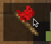
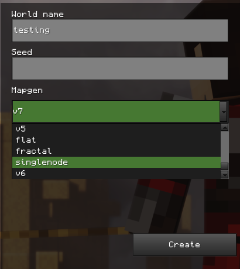

# Map Tester Handbook

## Table of Contents
> I will do later; the headings will be changed

> ## Outline
> 1. Labels to be aware of ✅
> 2. PR scheme ✅
> 3. Map works/errors 
> 4. ^ Some error specifics
> 5. Flags and the base
> 6. Team zones and testing process
> 7. Config (to be discussed later) (also includes proper fields filled)
> 8. Design/glitches/mistakes/inconsistencies, balance/opinion
> 9. Screenshot 
> 10. More to be included and discussed upon
> Ignore the above ;)

## Prequisites
1. The `Capture the Flag` game. To get it,
	- Go to the `Content` Tab in your Minetest client.
	- Click `Browse Online Content` 
	- Search for `capturetheflag` (make sure that the `Games` category is selected)
	- Click on the `+` icon to install it.
2. `WorldEdit` mod.
	- Download it as you did for the CTF game, but you should have `Mods` as the category set.
	- 
## Structure of the Repository

### 1. Where do I find maps for CTF?
All the [maps on CTF](https://github.com/mt-CTF/maps) are in a repository on [GitHub](https://en.wikipedia.org/wiki/GitHub), the website via which you may be reading this. GitHub is one of the “many platforms and cloud-based services for software development and version control using `Git`, allowing developers to store and manage their code.” But no worries, you don't need to be a full-stack coder to use Git. 

### 2. What do the folders and files mean?
The repository contains folders dedicated to each map. For example, the folder containing the required files for the “Intervention in the Ice Age” Map is in the folder `iceage`. The scheme of a map folder in the repository should be as shown below:
```
<map folder>
  ├── map.conf
  ├── map.mts
  └── screenshot.png
```
1. `map.conf`: The file contains metadata about various constants and fields essential to the map.
2. `map.mts`: A schematic file (`.mts`) is used to import the map into the game world.
3. `screenshot.png`: A screenshot of the map. It should make the important parts of the map visible and is needed to have an aspect ratio of 3:2 (600×400px is suggested).

## What is GitHub and Git?
GitHub is a platform that hosts Git repositories and provides developers with several tools to assist their projects. Git is a free and open source version control system designed to handle everything from small to very large projects. Basically, GitHub is a site for managing code and various other projects using the Git. For now, this handbook will only cover the basic ways of obtaining the files you require for testing maps without the need of any command line interface. The handbook for that is a work in progress.

### 3. Git Terms
Below is a list of a few terms you should be aware of while map making. Don't be intimidated by these, but keep them in mind for future reference. 
- A **repository**, is the remote storage in which code is stored.
> In this case, the map's repository only contains the map folders and their respective files.
- A **fork** is a new repository that shares code and settings from the original repository. It can be modified and then be made into a **pull request** if needed.
> Here, map makers will be _forking the maps repository, making their needed additions, like adding maps, and then making a Pull Request_ (more on that below).
- A **branch** refers to a separate line of development that initially has the same code base as the repository in which it was made. This new branch can have its own set of files and commits.
- A **commit** means saving changes made to a project's files to the repository itself.
- A **pull** from a repository simply means getting the source code from the remote repository to one's local machine
- A **push** means pushing the locally built source code to a remote repository on a repository management platform such as GitHub.
- A **pull request** (PR) refers to when you make changes in one of your branches and try to integrate those changes with the main repository.

## How to know which maps to review?
#### *Where to find Map PRs?*
- Go to the [maps repository](https://github.com/mt-CTF/maps) on your web browser.
- Click the "Pull Requests" section like this:

- You will come to notice PRs with some labels. If you click the PR, it will take you to it.
- There will be a series of tabs that will help you navigate through the things related to it. (An example image is shown below)

- You can discuss about the PR and leave your reviews in the ***Conversation*** section. The ***Commits*** tab lists the commits that the (will do).

#### *Labels on Pull Requests*
The Map PRs have labels which indicate their current stage in development. You should look for the ***"New Map"*** and ***"Review Required :mag:"***. There are also others, such as, ***"PR not created properly"*** ***"WIP :building_construction:"*** (= Work In Progress), ***"Enhancement"***, ***"Action/change needed :grey_exclamation:"*** and so on. All these describe about a particular PR. An example of one that you can test is:


## Getting the PR files for testing
- Go the the `Pull Requests` and click on the Map PR you would like to review. 
- Click on the blue text indicating the `<username>:<branch-of-their-fork>` as shown below.

- After doing so, use the `Download ZIP` option like this:

- Extract the ZIP folder and select the particular map folder that has been added by the author of the PR within the extracted folders. In the example PR mentioned, the folder is `sewer_village`
- After successfully identifying the new map folder, copy and paste it to `<YOUR MINETEST FOLDER>/games/capturetheflag/mods/ctf/ctf_map/maps/` on your computer.
- You have now retrieved the required map folder!
> Make sure that the map has all the required files, namely, `map.mts`, `map.conf`, and `screenshot.png`. If not, then drop a message regarding it in the PR unless not addressed by others.

## Testing the Map
### 1. Map config
The configuration settings for the map are in the `<map_folder>/map.conf` file. It *should* satisfy the list below:
- The map should be enabled. (`enable = true`)
- The map has a license. It should be in the family of free (as in freedom) culture licenses like `CC BY-SA 4.0`. Note that not all Creative Commons licenses are free. For e.g., `CC BY-ND`.
- The initial items for the map are 
- It has a suitable map hint. 
You can check for these before or after testing the map in-game.
### 2. Making the world
- Open your Minetest client and make sure you are in the `Start Game` tab.
- Click the `capturetheflag` game icon. It looks like this:


- Click the `New World` button.
- Let's name this world as "testing", but you can name it as you wish. It is important that you make sure that you are setting the world's mapgen as `singlenode`, like the below screenshot.


- Finally, click `Create`.
### 3. Playing the game
- Select the new world that you just created.
- Disable `Creative Mode` to be able to play a match of CTF. It is your choice whether you want `Enable Damage` on or off.
- To enable the `WorldEdit` mod, press `Select Mods` and double click the `WorldEdit` mod name to enable it.
- Then click `Play Game` to begin. An example if shown below.

### 4. Choosing the Map
> You will need the `ctf_admin` privilege to run most of the commands in this handbook. So, grant yourself the privs using `/grantme ctf_admin`. If you would like other privileges suck as `fly`, `nolcip`, `fast`, etc., then running the `/grantme all` command would cover them all.

Upon starting the game, you will be playing like how the server works, with a random map at first. To choose your map, run `/ctf_next -f <map_folder>` . In the case of the example PR, it would be `/ctf_next -f sewer_village`.

### 5. Map Requirements
#### Basics
- There are no errors that show up (red text in the chat) when loading/playing the map. The error would indicate what is causing the issue.
- The area under the flag, that is the floor of the base, should be unbreakable and have an area of 5x5 blocks at minimum.
- The map **should** be inescapable. Meaning it should be surrounded by "Indestructible Barrier Glass" (`ctf_map:ind_glass`) above ground and/or indestructible variants of blocks on the walls of the map that are below the ground and the floor of the map being destructible as well. 
- It has the Red Barriers that disappear when build time gets over. Check if all of these are placed properly, no areas that require it are missing, and they get removed without any remaining.
- Chests are functional.
- Flags can be captured without any bugs.
- The team boundaries behave as they should:
	- Player should get teleported during build time if they are *in* the red barrier. This is where the team zones overlap.
	- All the boundaries of the team zone are till where they should be and work as intended. You can test this by going to the edges and walls of the map.
#### Mechanics
- All the teams should have an **equal chance of winning**. This includes, base position, balance, ore count, etc.
> To count ores in a region, you can use WorldEdit.
> 1. Go to the first coordinate of the region and run `//1`.
> 2. Go the second position and run `//2`.
> 3. Replace all the ores (using its technical name) you want to find the count for with air. You will see how many were replaced, giving the count. If the ore is mese ore (`default:stone_with_mese`), then run `//r default:stone_with_mese air`.
> A set of common ore technical names you may want to test for are 
# Individual sources
## -sniper-'s message contents
You can test any map anytime. It is recommended to first test Pull requests with a `Review required` label because other maps usually already have bugs/issues.

What should map tester look for? Issues or bugs such as:

- First map tester should check if map works in CTF game.
- Map should be unique and not similar to other maps. So this means that most of plain maps will be rejected if they are not interesting. The design of a map should encourage differing gameplay and tactics.
- It should be fun to play on it.
- Maps shouldn't be glitchy (i.e., no holes which lead into voids, no wrongly placed barriers). Barriers should be placed properly, red barrier should disappear on match start.
- Maps should not contain not-supported blocks (such as chests, rails, butterflies...). If there is not-supported block on a map, you will see red error in chat, starting with `Failed to resolve node name...`
- Map must have a **valid Free Software/Open Source license** . There should be a line in `map.conf`:` license = <license_name>`
- Maps should be reasonably balanced - i.e.: two team of equal ability would have the same chance of winning. One team should not have advantage (for example more ores, better position...).
- Players shouldn't be able to escape from the map - i.e. go outside of the barrier
- Pull request (=PR) should contain `map.mts`, `map.conf` and `screenshot.png`. If PR contain zip files for example, then it is not created properly. Screenshot should have ratio 3:2 (750x500px for example)
- Player should be able to pick and capture flag.
- Something what I have probably forgotten to add ¯\_(ツ)_/¯

And finally, write your review as a comment in PR. **Tell your opinion** (fun/not fun, missing license, doesn't work...). Every opinion matters.
